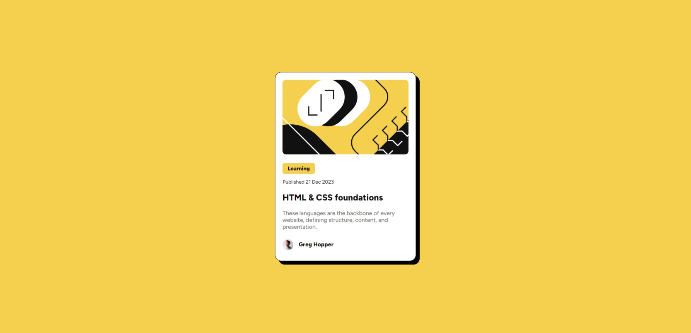

# Frontend Mentor - Blog preview card solution

This is a solution to the [Blog preview card challenge on Frontend Mentor](https://www.frontendmentor.io/challenges/blog-preview-card-ckPaj01IcS). Frontend Mentor challenges help you improve your coding skills by building realistic projects. 

## Table of contents

- [Overview](#overview)
  - [The challenge](#the-challenge)
  - [Screenshot](#screenshot)
  - [Links](#links)
- [My process](#my-process)
  - [Built with](#built-with)
  - [What I learned](#what-i-learned)
- [Author](#author)

## Overview

### The challenge

Users should be able to:

- See hover and focus states for all interactive elements on the page

### Screenshot

### Links

- Solution URL: [Solution](https://www.frontendmentor.io/solutions/blog-preview-card-using-htmlcss-0-9MXjbFWT)
- Live Site URL: [Site](https://ahmed-l2.github.io//frontend-projects/blog-preview-card-main/index.html)

## My process

### Built with

- HTML5
- CSS

### What I learned

Learned the use of basic HTML and CSS

## Author

- Author - [Ahmed](https://github.com/Ahmed-l2)
- Frontend Mentor - [@ahmed-l2](https://www.frontendmentor.io/profile/Ahmed-l2)