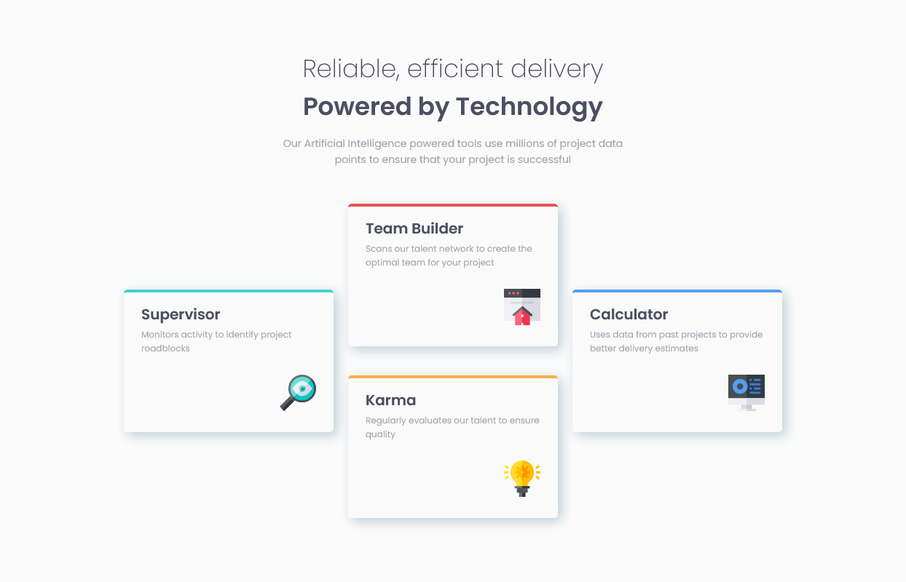
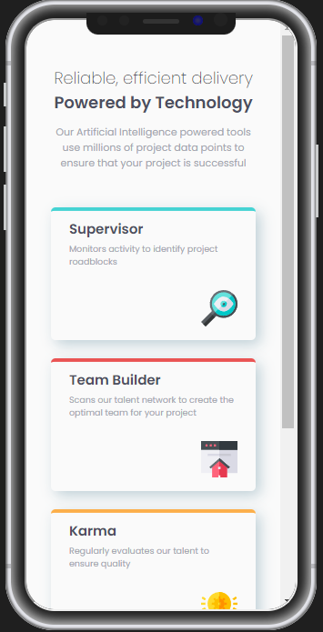

# Frontend Mentor - Four card feature section solution

This is a solution to the [Four card feature section challenge on Frontend Mentor](https://www.frontendmentor.io/challenges/four-card-feature-section-weK1eFYK). Frontend Mentor challenges help you improve your coding skills by building realistic projects. 

## Table of contents

- [Overview](#overview)
  - [Screenshot](#screenshot)
  - [Links](#links)
- [My process](#my-process)
  - [Built with](#built-with)
  - [What I learned](#what-i-learned)
- [Author](#author)

## Overview

### Screenshot

### Links

- Solution URL: [Solution]()
- Live Site URL: [Link]()

## My process

### Built with

- HTML5 markup
- CSS

### What I learned

Once again, I've taken the mobile-first approach and I'm getting more comformtable using flexbox and creating responsive designs

## Author

[Ahmed](https://github.com/Ahmed-l2)