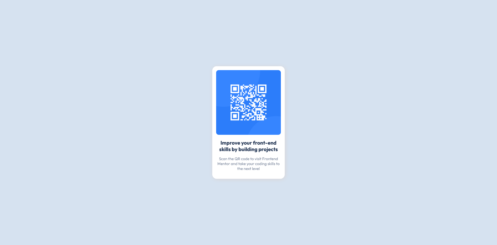

# Frontend Mentor - QR code component solution

This is a solution to the [QR code component challenge on Frontend Mentor](https://www.frontendmentor.io/challenges/qr-code-component-iux_sIO_H). Frontend Mentor challenges help you improve your coding skills by building realistic projects. 

## Table of contents

- [Overview](#overview)
  - [Screenshot](#screenshot)
  - [Links](#links)
- [My process](#my-process)
  - [Built with](#built-with)
  - [What I learned](#what-i-learned)
- [Author](#author)

## Overview

### Screenshot

### Links

- Solution URL: [Solution](https://github.com/Ahmed-l2/frontend-projects/blob/main/qr-code-component-main/index.html)
- Live Site URL: [Link](https://ahmed-l2.github.io/frontend-projects/qr-code-component-main/index.html)

## My process

### Built with

- HTML5 markup
- CSS

### What I learned

I've learned some basic HTML and CSS

## Author

[Ahmed](https://github.com/Ahmed-l2)
