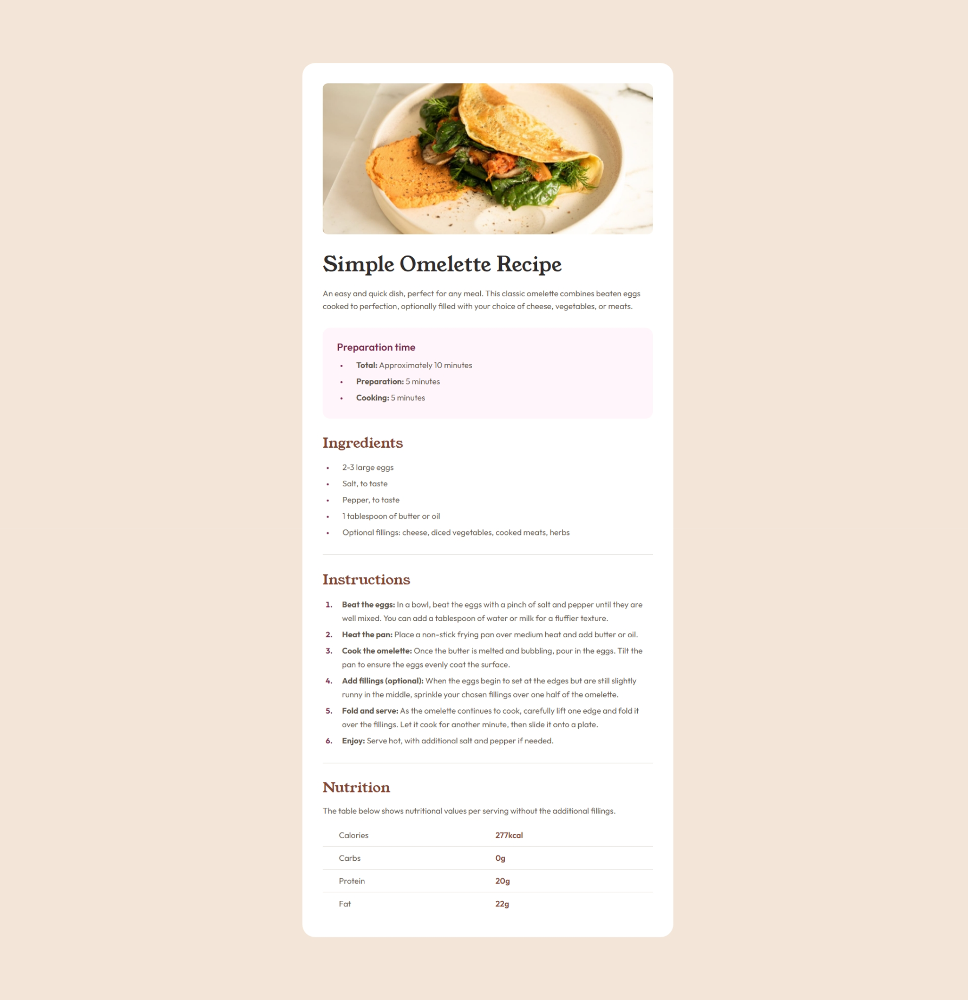
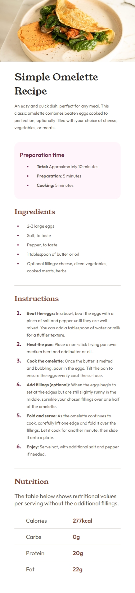

# Frontend Mentor - Recipe page solution

This is a solution to the [Recipe page challenge on Frontend Mentor](https://www.frontendmentor.io/challenges/recipe-page-KiTsR8QQKm). Frontend Mentor challenges help you improve your coding skills by building realistic projects. 

## Table of contents

- [Overview](#overview)
  - [Screenshot](#screenshot)
  - [Links](#links)
- [My process](#my-process)
  - [Built with](#built-with)
  - [What I learned](#what-i-learned)
- [Author](#author)

## Overview

### Screenshot

### Links

- Solution URL: [Solution]()
- Live Site URL: [Link]()

## My process

### Built with

- HTML5 markup
- CSS

### What I learned

This one was actually a bit time consuming because there were small details that needed to be focused on. I was totally unfamiliar with how I can manage to get the page to display properly on mobile screens and this was the first time I've had to deal with this and I can say that I'm very proud of the outcome and I've learned alot about sizing elements and making sure they function properly with on different screen sizes.

## Author

[Ahmed](https://github.com/Ahmed-l2)