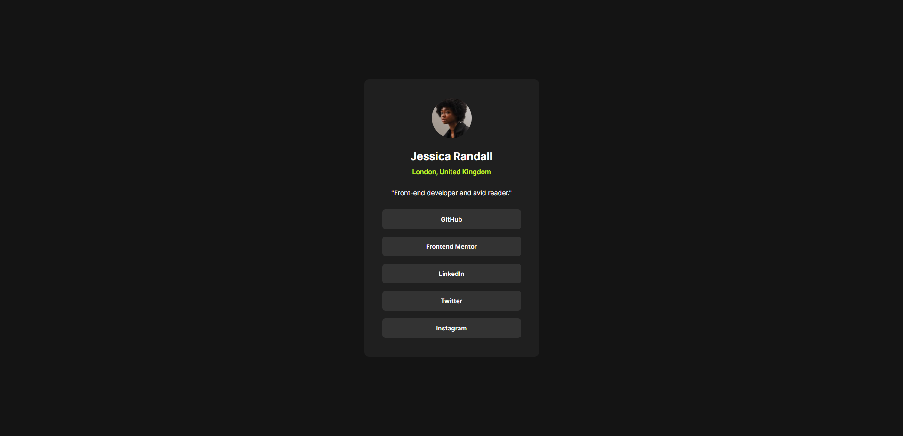
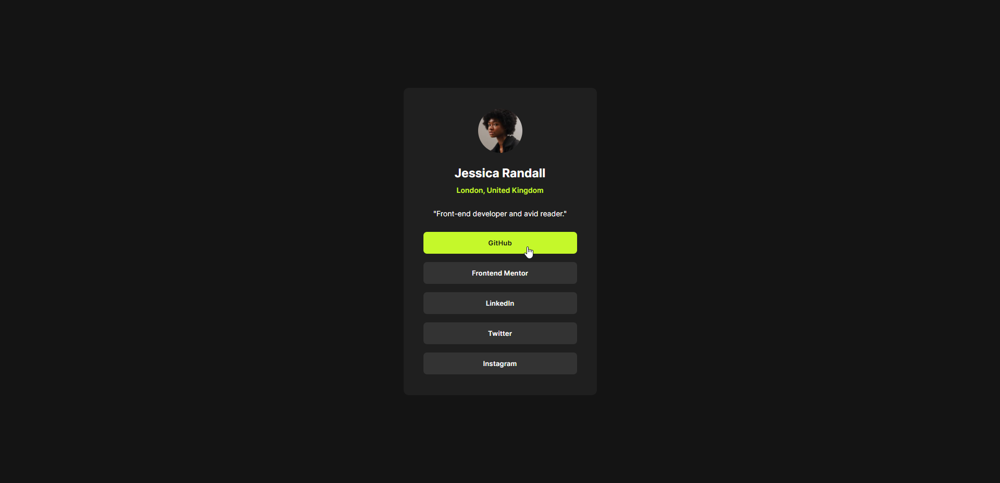

# Frontend Mentor - Social links profile solution

This is a solution to the [Social links profile challenge on Frontend Mentor](https://www.frontendmentor.io/challenges/social-links-profile-UG32l9m6dQ). Frontend Mentor challenges help you improve your coding skills by building realistic projects. 

## Table of contents

- [Overview](#overview)
  - [Screenshot](#screenshot)
  - [Links](#links)
- [My process](#my-process)
  - [Built with](#built-with)
  - [What I learned](#what-i-learned)
- [Author](#author)

## Overview

### Screenshot

### Links

- Solution URL: [Solution](https://www.frontendmentor.io/solutions/social-links-profile-using-htmlcss-LKm9DOnPGk)
- Live Site URL: [Link](https://ahmed-l2.github.io/frontend-projects/social-links-profile-main/index.html)

## My process

### Built with

- HTML5 markup
- CSS

### What I learned

I've learned some basic HTML and CSS

## Author

[Ahmed](https://github.com/Ahmed-l2)
